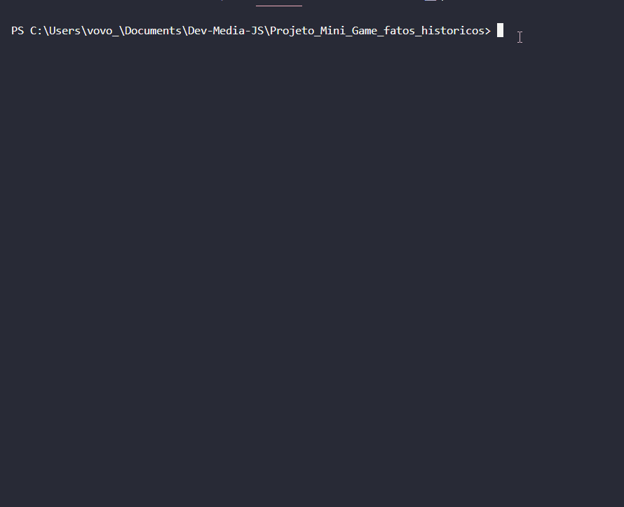

#Projeto_Mini_Gamer_Fatos_Históricos

#Projeto Desenvolvido com intuito de aprimorar e treinar habilidades com JavaScript no lado do beckend.

- Para clonar o repositório na sua máquina utilize um versionador de código, eu utilizo Git.
- Crie uma pasta na sua área de trabalho.
- Abra seu programa de versionamento com a pasta.
- Escreva no seu terminal o seguinte comando: git clone https://github.com/UandersonLim/Mini_jogo_fatos_historicos.git
- Após isso, inicie o repositório clonado com uma IDE, de preferência o VScode.
- Vá até o terminal da IDE, e digite npm init -y.
- Agora digite no terminal npm install readline-sync.

- APÓS TODOS ESSES PASSOS, EXECUTE O CÓDIGO.

<html>
    

        
    

</html>